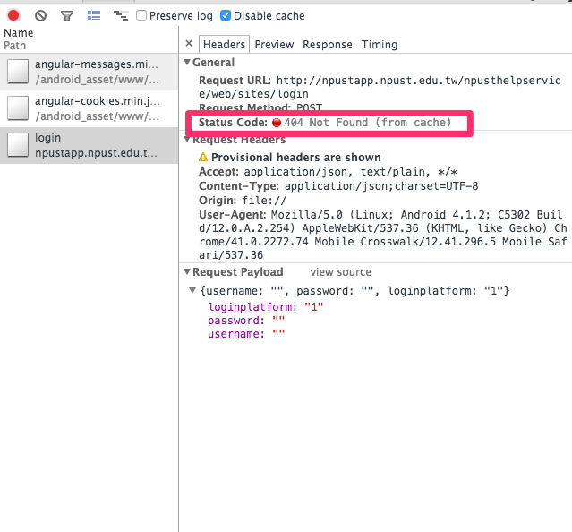
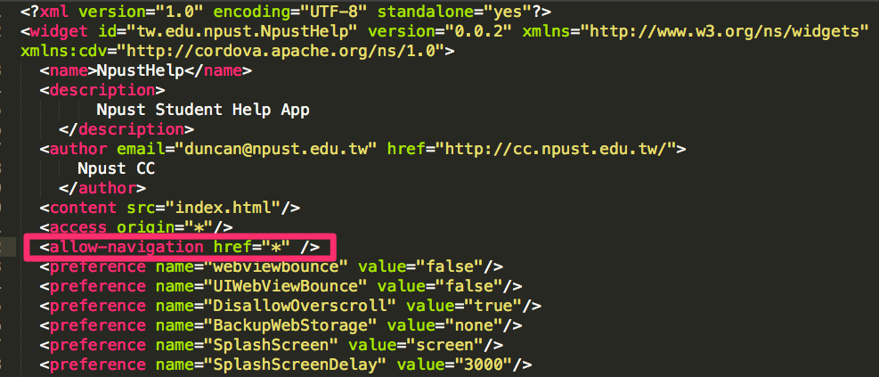
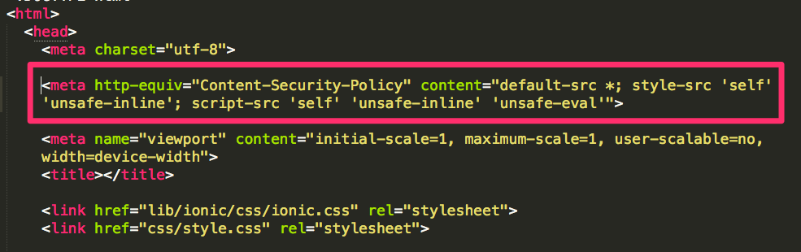
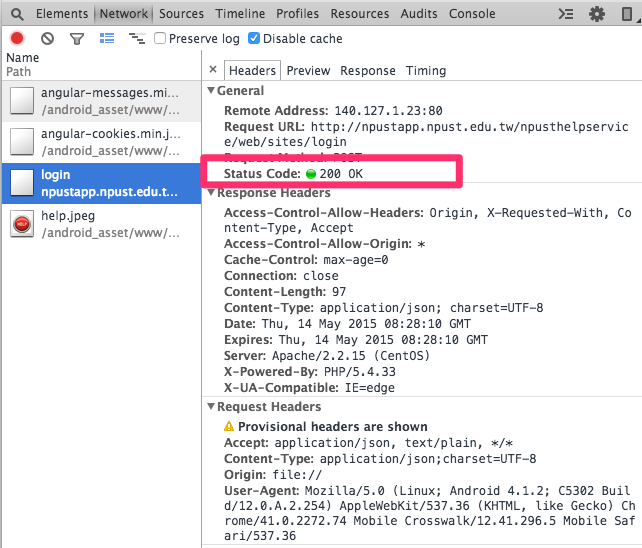

##ionic crosswalk http post 404錯誤解決方法

###錯誤問題點
-
使用ionic建置好專案後,會安裝crosswalk建立Android平台,目前發生了在Android平台進行App登入動作,發現App沒有任何動作,故利用Chrome去inspect,發現了404錯誤

###解決方法
-

1. 安裝``cordova-plugin-whitelist``套件
	
	>
		ionic plugin add https://github.com/apache/cordova-plugin-whitelist
	>
	
2. 到config.xml新增``<allow-navigation>``tag

	>
		<allow-navigation href="*" />
	>
	

3. 到index.html新增``<meta>``tag

	>
		<meta http-equiv="Content-Security-Policy" content="default-src *; style-src 'self' 'unsafe-inline'; script-src 'self' 'unsafe-inline' 'unsafe-eval'">

	>

 
	
###成功畫面
-

 